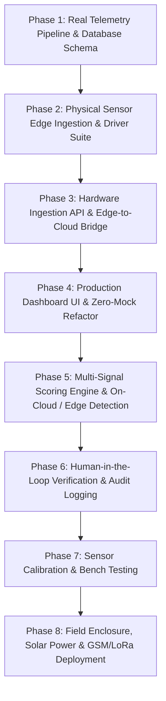

# GalamseyGuard — Physical Sensor Implementation Master Plan

> **Systematic, Hardware-First Deployment Roadmap for the GalamseyGuard IoT Environmental Activity & Machinery Pattern Detection System**

---

## Executive Summary

**GalamseyGuard** is an IoT-based environmental monitoring and activity detection platform designed to capture, aggregate, analyze, and visualize physical multi-sensor environmental telemetry (acoustic, dynamic vibration, meteorological, and geospatial coordinates) to identify activity patterns associated with heavy machinery.

Now that the **physical hardware sensors are available** (INMP441 digital microphone, MPU-6050 3-axis accelerometer, BME280 environmental sensor, rain detection module, and GPS), this plan transitions the project from a simulated prototype to a **complete physical implementation**:

1. **Hardware-Grounded Edge Telemetry**: Edge compute units (Raspberry Pi 4/3B+ or ESP32 microcontrollers) interface directly with physical sensors, calculate real acoustic RMS and FFT frequency spectra, compute dynamic 3-axis vibration magnitude, sample ambient barometric/weather data, and transmit JSON packets conforming to the Section 8 schema.
2. **Zero-Mock Production Pipeline**: All synthetic sine-wave loops, random bumps, and fake alerts have been purged from the project. The dashboard operates exclusively on real telemetry streamed via Supabase Realtime or local edge gateways.
3. **Responsible Automated Detection & Human-in-the-Loop Governance**: Automated risk scores trigger an operational alert workflow (`UNREVIEWED` $\rightarrow$ `ACKNOWLEDGED` $\rightarrow$ `UNDER REVIEW` $\rightarrow$ `RESOLVED` / `FALSE POSITIVE`) with standardized non-accusatory language:
   > *"Possible machinery-related activity detected. Human verification required."*

---

## Architecture Overview

```text
┌────────────────────────────────────────────────────────────────────────┐
│                   PHYSICAL EDGE SENSOR LAYER                           │
│                                                                        │
│   Raspberry Pi 4 / 3B+ / ESP32 Wireless Sensor Nodes                   │
│   ├── INMP441 (I2S Digital Microphone) ──> Sound RMS & FFT Freq Peak   │
│   ├── MPU-6050 (I2C Accelerometer)    ──> Dynamic 3-Axis Vibration RMS │
│   ├── BME280 (I2C Weather)            ──> Temp, Humidity, Pressure     │
│   ├── Rain Module (Digital GPIO 17)   ──> Rain Dampening Flag (x0.75)  │
│   └── NEO-6M GPS (UART Serial)        ──> Geospatial Coordinates & UTC │
└───────────────────────────────────┬────────────────────────────────────┘
                                    │ HTTPS REST / WebSocket / Local LAN
                                    ▼
┌────────────────────────────────────────────────────────────────────────┐
│                   INGESTION & BACKEND CLOUD LAYER                      │
│                                                                        │
│   Supabase (PostgreSQL 15+) & Local Edge Gateway                       │
│   ├── Public Tables: stations, sensor_readings, alerts, device_health  │
│   ├── Realtime Replication: postgres_changes CDC over WebSockets       │
│   ├── Row-Level Security (RLS) & Indexed Timescale Telemetry           │
│   ├── Local Edge Gateway (`edge/local_ingestion_server.py`)            │
│   └── Offline SQLite Resiliency Queue (`edge_buffer.sqlite`)           │
└───────────────────────────────────┬────────────────────────────────────┘
                                    │ Realtime State Sync (WebSocket)
                                    ▼
┌────────────────────────────────────────────────────────────────────────┐
│                   OPERATOR MONITORING CONSOLE                          │
│                                                                        │
│   React 19 + TypeScript + Vite + Tailwind CSS                          │
│   ├── Operational Fleet Hub (Live Online Stations & Network Status)    │
│   ├── Geospatial Map (Leaflet / Esri Canvas with Live Status Badges)  │
│   ├── Real-Time Telemetry Gauges (6 Core Environmental Instruments)    │
│   ├── Historical Progression Charts (Recharts Multi-Metric Trends)     │
│   ├── Alert Management Console (Section 10 Human Verification Flow)   │
│   └── Hardware Diagnostics Modal (Pinouts, Commands & Ingestion Feed)  │
└────────────────────────────────────────────────────────────────────────┘
```

---

## Supabase as the Bridge Between Raspberry Pi and React Dashboard

### 1. Objective

The GalamseyGuard prototype will use **Supabase as the central data bridge** between the Raspberry Pi monitoring station and the React web dashboard.

The Raspberry Pi and React dashboard will not need to run on the same computer or local network.

The communication architecture will be:

```text
┌──────────────────────┐
│    RASPBERRY PI      │
│                      │
│  Sensors             │
│  Python              │
│  Data Processing     │
│  Device Health       │
└──────────┬───────────┘
           │
           │ HTTPS
           ▼
┌──────────────────────┐
│       FASTAPI        │
│                      │
│  Device API          │
│  Validation          │
│  Processing          │
│  Authentication      │
└──────────┬───────────┘
           │
           │
           ▼
┌─────────────────────────────────┐
│            SUPABASE              │
│                                 │
│  PostgreSQL Database             │
│  Authentication                  │
│  Realtime                        │
│  Row Level Security              │
└───────────────┬─────────────────┘
                │
                │ HTTPS / Realtime
                ▼
┌─────────────────────────────────┐
│       REACT DASHBOARD            │
│                                 │
│  Map                            │
│  Sensor Readings                │
│  Historical Charts              │
│  Activity Indicators            │
│  Alerts                         │
└─────────────────────────────────┘
```

---

### 2. Why Supabase Acts as the Bridge

The Raspberry Pi and the React dashboard have different responsibilities.

#### Raspberry Pi

The Raspberry Pi is responsible for:

- Reading physical sensors
- Processing sensor signals
- Extracting useful features
- Reading GPS
- Monitoring device health
- Sending data to the backend

#### React Dashboard

The React application is responsible for:

- Displaying sensor information
- Displaying station locations
- Displaying historical charts
- Displaying activity indicators
- Displaying alerts
- Allowing authorized users to review alerts

#### Supabase

Supabase acts as the shared cloud data layer.

It provides:

- Persistent storage
- PostgreSQL database
- Authentication
- Realtime updates
- Access control
- API access

Therefore:

> **The Raspberry Pi writes monitoring information into the system, while the React dashboard reads and visualizes that information through Supabase.**

---

### 3. Data Flow

The primary data flow will be:

```text
Physical Sensors (INMP441, MPU-6050, BME280, Rain, GPS)
      ↓
Raspberry Pi (Hardware Sampling & Feature Extraction)
      ↓
Python Sensor Application (RMS, FFT, Vibration & Health Telemetry)
      ↓
FastAPI Device Ingestion Gateway (Validation, Ingestion & Device Auth)
      ↓
Supabase Database (PostgreSQL Storage & Realtime CDC Engine)
      ↓
React Dashboard (Live Telemetry, Geospatial Mapping & Incident Verification)
```

---

## Implementation Phases



---

### Phase 1: Real Telemetry Pipeline & Database Schema

**Goal:** Establish cloud and edge data persistence conforming to Section 8 of the project vision.

#### 1.1 Schema Implementation (`supabase/schema.sql`)
- `stations`: Physical station ID (`GG-001`), hardware device identifier, human-readable name, GPS coordinates, operational status (`ONLINE`, `OFFLINE`, `MAINTENANCE`).
- `sensor_readings`: High-throughput time-series telemetry table with B-tree index on `(station_id, timestamp DESC)`. Captures:
  - `sound_rms` (0.000 to 1.000) & `dominant_frequency` (Hz).
  - `vibration_rms` (0.000 to 1.000).
  - `temperature` (°C), `humidity` (%), `pressure` (hPa).
  - `rain_detected` (boolean).
  - `activity_score` (0 to 100) & `risk_level` (`NORMAL`, `ELEVATED`, `HIGH`, `CRITICAL`).
- `alerts`: Human verification incident table with reviewer notes, review timestamps, and snapshot readings.
- `device_health`: Hardware battery percentage, solar charging state, network interface, and uptime.
- Enable `supabase_realtime` publication for all tables.

#### Deliverables & Acceptance Criteria
- [x] Clean PostgreSQL schema in `supabase/schema.sql`.
- [x] Initial station records registered for Southern Ghana basins (Pra River, Atewa, Tarkwa).
- [x] Realtime replication enabled on telemetry tables.

---

### Phase 2: Physical Sensor Edge Ingestion & Driver Suite

**Goal:** Interface physical sensors with edge hardware and perform on-device signal processing.

#### 2.1 Hardware Connections & Pinouts (`docs/hardware_setup.md`)
| Sensor | Interface | Measurement | Raspberry Pi GPIO | ESP32 Pin |
|---|---|---|---|---|
| **INMP441** | I2S Digital | Acoustic RMS & FFT Spectrum Peak | GPIO 18 (CLK), 19 (WS), 20 (DIN) | GPIO 26 (SCK), 25 (WS), 22 (SD) |
| **MPU-6050** | I2C (`0x68`) | 3-Axis Dynamic Vibration RMS | GPIO 2 (SDA), GPIO 3 (SCL) | GPIO 21 (SDA), GPIO 22 (SCL) |
| **BME280** | I2C (`0x76`) | Temperature, Humidity, Barometer | GPIO 2 (SDA), GPIO 3 (SCL) | GPIO 21 (SDA), GPIO 22 (SCL) |
| **Rain Sensor** | Digital / GPIO | Rain Presence (Dampening) | GPIO 17 | GPIO 34 |
| **NEO-6M GPS** | UART Serial | GPS Coordinates & UTC Time | GPIO 14 (TX), GPIO 15 (RX) | GPIO 16 (RX2), GPIO 17 (TX2) |

#### 2.2 Edge Software Implementation
- **Python Edge Daemon (`edge/sensor_agent.py`)**:
  - Samples audio at $16\text{ kHz}$ over I2S/USB, computes true RMS amplitude and FFT spectral peak (targeting the $50\text{–}200\text{ Hz}$ heavy diesel band).
  - Reads MPU-6050 at $50\text{ Hz}$, subtracts stationary gravity ($9.81\text{ m/s}^2$), and calculates dynamic root-mean-square vibration magnitude.
  - Reads BME280 weather metrics and rain digital state.
  - Computes multi-sensor activity score locally.
  - Posts JSON to Supabase REST API (`/rest/v1/sensor_readings`) or local gateway.
  - Implements offline SQLite queueing (`edge_buffer.sqlite`) to buffer packets during cellular drops.
- **ESP32 Firmware (`edge/esp32_firmware/galamsey_sensor_node.ino`)**:
  - Self-contained C++ Arduino sketch for wireless sensor nodes streaming JSON over Wi-Fi.

#### Deliverables & Acceptance Criteria
- [x] Complete Python edge agent (`edge/sensor_agent.py`).
- [x] ESP32 wireless firmware (`edge/esp32_firmware/galamsey_sensor_node.ino`).
- [x] Hardware wiring guide and pinout documentation (`docs/hardware_setup.md`).

---

### Phase 3: Hardware Ingestion API & Edge-to-Cloud Bridge

**Goal:** Provide flexible, reliable connectivity for edge devices whether connected to cloud or local networks.

#### 3.1 Local Ingestion Gateway (`edge/local_ingestion_server.py`)
- Lightweight HTTP REST server listening on port `5000` with CORS enabled.
- Accepts `POST /api/telemetry` and relays to Supabase while exposing `GET /api/latest` for local frontend dashboards.
- Enables bench-testing and isolated local deployments without internet access.

#### 3.2 Direct Cloud REST & Realtime Sync (`src/config/supabase.ts`, `src/services/realSensorService.ts`)
- Client connects via `VITE_SUPABASE_URL` and `VITE_SUPABASE_ANON_KEY`.
- Subscribes to `INSERT` on `sensor_readings` and `alerts` via Supabase Realtime channels.
- Automatic reconnection and status reporting.

#### Deliverables & Acceptance Criteria
- [x] Local ingestion server in `edge/local_ingestion_server.py`.
- [x] Real-time Supabase service in `src/services/realSensorService.ts`.
- [x] Configuration template in `.env.example`.

---

### Phase 4: Production Dashboard UI & Zero-Mock Refactor

**Goal:** Cleanse all fake data from the web application and present real-time physical telemetry.

#### 4.1 Zero-Mock Purge
- Removed `generateInitialReadings` (synthetic sine/cosine waves) and fake alerts from `src/services/mockData.ts`.
- Removed auto-ticking simulation loop from `src/services/simulatorService.ts`.
- Replaced scenario injector drawer with the **Hardware Diagnostics & Ingestion Console** (`src/components/hardware/HardwareStatusModal.tsx`).
- Updated `StationCharts.tsx` with clean awaiting-telemetry states when no physical sensor readings have arrived yet.

#### 4.2 Real-Time Monitoring Views
- **Fleet Hub**: High-level KPI cards and operational station grid.
- **Station View**: 6-gauge real-time telemetry suite (Sound dB, Dominant Freq, Vibration RMS, Temperature, Humidity, Rain).
- **Geospatial Map**: Leaflet interactive map with real GPS coordinates and risk color badges.
- **Alerts Manager**: Section 10 human verification review console.

#### Deliverables & Acceptance Criteria
- [x] Zero mock data generated at runtime.
- [x] Clean "Awaiting physical sensor telemetry" empty states.
- [x] Hardware Diagnostics modal with live ingestion status, pinouts, and quickstart commands.
- [x] TypeScript build compiles with 0 errors (`tsc -b && vite build`).

---

### Phase 5: Multi-Signal Scoring Engine & On-Cloud / Edge Detection

**Goal:** Accurately classify physical telemetry into environmental activity scores while dampening weather false alarms.

#### 5.1 Multi-Sensor Fusion Formula
$$S_{\text{raw}} = 0.50 \times S_{\text{acoustic}} + 0.35 \times S_{\text{vibration}} + 0.15 \times S_{\text{baseline}}$$

1. **Acoustic Sub-Score ($S_{\text{acoustic}}$)**:
   - Evaluates amplitude ($RMS$) and applies frequency weighting if dominant frequency falls in the heavy diesel exhaust/engine range ($50\text{–}220\text{ Hz}$).
2. **Vibration Sub-Score ($S_{\text{vibration}}$)**:
   - Evaluates continuous mechanical oscillation from excavators and wash plants.
3. **Rain Dampening Coefficient**:
   $$\text{If } \text{rain\_detected} == \text{True}: \quad S_{\text{final}} = S_{\text{raw}} \times 0.75$$
   - Prevents tropical rainstorms (which generate loud acoustic white noise but zero ground vibration) from triggering false alerts.

#### 5.2 Risk Categorization
- `0 - 34`: **NORMAL** (Ambient river/forest baseline)
- `35 - 59`: **ELEVATED** (Unusual acoustic or vibrational noise)
- `60 - 79`: **HIGH** (Machinery pattern detected; automated alert generated)
- `80 - 100`: **CRITICAL** (Sustained heavy machinery signature)

#### Deliverables & Acceptance Criteria
- [x] Scoring engine in `src/utils/scoringEngine.ts` and `edge/sensor_agent.py`.
- [x] Heavy diesel frequency band weighting (50–220 Hz).
- [x] Rain dampening logic verified.

---

### Phase 6: Human-in-the-Loop Verification & Audit Logging

**Goal:** Guarantee that no automated system makes legal accusations without human inspection.

#### 6.1 Alert Lifecycle
$$\text{UNREVIEWED} \longrightarrow \text{ACKNOWLEDGED} \longrightarrow \text{UNDER REVIEW} \longrightarrow \text{RESOLVED} \text{ / } \text{FALSE POSITIVE}$$

- **Mandatory Responsible Phrasing**:
  > *"Possible machinery-related activity detected. Human verification required."*
- **Audit Logging**: Captures reviewer notes, resolution timestamp, and frozen snapshot readings.

#### Deliverables & Acceptance Criteria
- [x] Interactive Alert Review Modal in `src/components/alerts/AlertsManager.tsx`.
- [x] Database persistence via `updateAlertStatus()` in `realSensorService.ts`.

---

### Phase 7: Sensor Calibration & Bench Testing

**Goal:** Calibrate physical sensors for target deployment environments.

#### 7.1 Calibration Utility (`edge/calibrate_sensors.py`)
- Measures ambient acoustic noise floor in dB and RMS.
- Computes accelerometer zero-G tare offsets ($X, Y, Z$) on stationary surfaces.
- Generates `edge/calibration.json`.

#### 7.2 Testing Checklist
- [ ] Connect INMP441, speak/play low-frequency diesel engine audio, verify FFT frequency peak shifts to 80–130 Hz.
- [ ] Tap/vibrate MPU-6050, verify Vibration RMS rises on dashboard.
- [ ] Drop water on rain sensor, verify rain dampening indicator engages.

---

### Phase 8: Field Enclosure, Solar Power & GSM/LoRa Deployment

**Goal:** Harden the system for autonomous deployment in Ghanaian river basins and forest reserves.

#### 8.1 Environmental Enclosure (IP67)
- Weatherproof polycarbonate junction box with acoustic mesh membrane for microphone and external rain sensor plate.
- Mounting bracket for tree trunk / riverbank stake installation.

#### 8.2 Power Budgeting
- $10\text{W}$ Monocrystalline Solar Panel + $12\text{V} / 5000\text{ mAh}$ LiFePO4 battery pack with MPPT solar charge controller.
- Low-power sleep modes for ESP32 nodes ($< 15\text{ mA}$ average consumption).

#### 8.3 Connectivity Redundancy
- Primary: 4G LTE cellular module (SIM7600 / SIM800L).
- Fallback: LoRaWAN 868/915 MHz long-range mesh for dense forest canopies without cell towers.

---

## Task Milestones & Current Progress

| Phase | Task Description | Status | Target Files |
|---|---|---|---|
| **1** | PostgreSQL schema & realtime replication | **Completed** | `supabase/schema.sql` |
| **1** | Supabase client & environment configuration | **Completed** | `src/config/supabase.ts`, `.env.example` |
| **2** | Python physical sensor edge daemon | **Completed** | `edge/sensor_agent.py`, `edge/requirements.txt` |
| **2** | ESP32 wireless node Arduino firmware | **Completed** | `edge/esp32_firmware/galamsey_sensor_node.ino` |
| **2** | Hardware wiring blueprint & pinouts | **Completed** | `docs/hardware_setup.md` |
| **3** | Local edge ingestion server & CORS bridge | **Completed** | `edge/local_ingestion_server.py` |
| **3** | Realtime sensor service with live push | **Completed** | `src/services/realSensorService.ts` |
| **4** | Purge mock data & fake sine tickers | **Completed** | `src/services/mockData.ts`, `src/services/simulatorService.ts` |
| **4** | Hardware Diagnostics & Ingestion Console | **Completed** | `src/components/hardware/HardwareStatusModal.tsx` |
| **4** | Awaiting telemetry empty states | **Completed** | `src/components/charts/StationCharts.tsx` |
| **5** | Multi-sensor scoring with rain dampening | **Completed** | `src/utils/scoringEngine.ts`, `edge/sensor_agent.py` |
| **6** | Human verification alert workflow | **Completed** | `src/components/alerts/AlertsManager.tsx` |
| **7** | Interactive sensor calibration script | **Completed** | `edge/calibrate_sensors.py` |
| **8** | Field bench testing & physical sensor stream | **Next Step** | Connect physical hardware & run `sensor_agent.py` |

---

## Next Steps for the Operator

With all mock data removed and the physical edge architecture deployed:
1. **Connect your sensors** according to [docs/hardware_setup.md](file:///c:/Users/VhimBoss/Desktop/Galamsey%20Activity%20Detector/docs/hardware_setup.md).
2. **Install edge dependencies**:
   ```bash
   pip install -r edge/requirements.txt
   ```
3. **Calibrate baselines**:
   ```bash
   python edge/calibrate_sensors.py
   ```
4. **Launch physical telemetry ingestion**:
   ```bash
   python edge/sensor_agent.py --station GG-001
   ```
   The web dashboard will instantly display the live incoming sensor telemetry in real-time.
